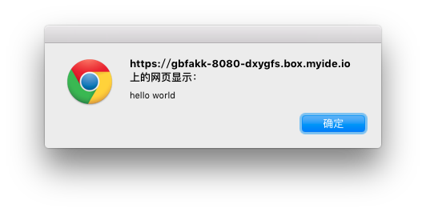

# 基本用法

为了演示webpack的强大，此处将分别演示如何使用webpack打包AMD、Common.js以及非模块化文件。

首先准备一个HTML（`example1.1.html`）：

```html
<html>
	<head>
		<title>webpack.toobug.net</title>
		<script src="./bundle1.1.js"></script>
	</head>
	<body>
	</body>
</html>
```

> 前面解释过，webpack是一个开发时进行打包的工具，因此我们需要准备两份文件，一份是用于开发维护的源码，一份则是由webpack打包生成的文件。
>
> 在这个示例中，我们关注源码就好。如果是放到实际项目中，则也需要仔细规划打包后文件的路径。

首先我们使用非模块化的方案，准备我们的源文件`example1.1.js`：

```javascript
alert('hello world');
```

接下来使用webpack将它打包：


```sh
cd {index.html所在目录}
webpack example1.1.js bundle1.1.js
```

此时就可以看到目录下生成了一个`bundle1.1.js`，正是我们在html中引用的JS文件。

访问一下`example1.1.html`，则可以看到我们的弹出框。

