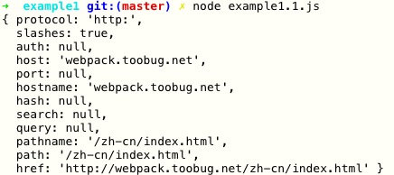
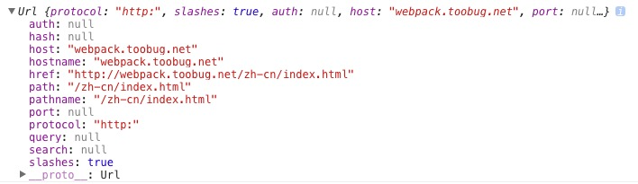

# Node和NPM

咦，明明在说前端代码，怎么突然要说Node和NPM？等等，哪里有说我在说前端代码？明明说的是JS代码。

好吧，前面的例子的确是在说前端代码，而且本指南全篇都将聚焦前端代码，但现在一个明显的趋势是前后端越来越趋向于融合，因此了解一些和Node/NPM的知识对于我们日常开发是有好处的。

上面的都是大道理，具体的事实大致有这些：

1. NPM已经不再是node package manager，而只是一个包管理软件，在NPM的愿景中是有前端代码这一块的
2. 越来越多的前端库也选择将代码发布到npm，包括jQuery / Angular / react等
3. 前端开发已经高度依赖于Node带来的生态端，比如各种各样的工具
4. 由于CommonJS在前端开发中应用的成熟，复用Node的代码成为可能（且越来越方便）

## 引用Node模块和NPM模块

既然webpack支持在前端使用CommonJS模块规范，那么是否意味着我们可以直接使用NPM模块，甚至是Node内置的模块呢？答案是肯定的，我们看一个例子：

首先准备同样的HTML和JS文件，不同的是，这次我们需要使用`npm init`准备一个`package.json`文件，因为安装npm依赖时需要用到。

```sh
npm init
```

接下来一顿回车，就生成了一个`package.json`。然后安装一个npm模块`cookie`，用于解析和生成cookies串。

```sh
npm install cookie --save
```

> `--save`会将依赖写入`package.json`，下次直接使用`npm install`即可安装依赖。

接下来编写JS文件`example1.1.js`：

```javascript
var url = require('url');
var urlResult = url.parse('http://webpack.toobug.net/zh-cn/index.html');
console.log(urlResult);

var cookie = require('cookie');
var cookieResult = cookie.parse('name=toobug; subject=webpack;');
console.log(cookieResult);
```

在这段代码里，我们分别使用Node内置的模块`url`和NPM中的模块`cookie`来解析字符串并输出结果。我们将这段JS分别在Node和浏览器中（经webpack编译）运行，最终输出如图：



Node.js输出截图



浏览器输出截图

也就是说，我们可以直接在浏览器端复用Node和NPM的代码了！不知道此时的你是否会感到很兴奋？！这意味着我们的代码可以前后端复用了，而更重要的是，前端也可以使用NPM海量的模块了，就像上例中我们使用了`cookie`这个模块，我们手中的工具一下子变强大了好多倍！

## Node模块和前端使用的CommonJS

Node使用的模块规范也是CommonJS，所以理想情况下，是可以做到代码在Node和浏览器中复用的。但这里面有几处关键的差异可能导致无法复用：

1. Node的模块在运行时会有一个包裹函数，下面详述
2. 浏览器并不支持所有的Node模块，因此部分使用了Node API的模块无法在浏览器中运行

首先我们来看一下Node模块在运行的时候真相是怎样的，假设我们有如下模块`example1.1.js`：

```javascript
var me = {};
module.exports = me;
```

这是一个非常简单的Node模块。不知道大家在写Node模块的时候是否有好奇过，这里的`module`（以及`require` / `exports` / `__filename` / `__dirname`）是从哪里来的？因为按照对JS的认知，如果它不是一个局部变量（含函数形参）的话，那么只能是全局变量了。

难道这些变量是全局变量？然而当我们打开Node的命令行去访问的时候又明明白白地告诉我们是`undefined`：

```sh
> console.log(global.exports)
undefined

> console.log(global.__dirname)
undefined

```

> 按照Node的文档，`global.require`确实是存在的，还有`.cache` / `.resolve()`等成员，但每个模块中使用的`require`仍然是局部变量，并非全局`require`。

这到底是怎么回事呢？如果在运行的时候去查看它的话，它会变成这样：

```javascript
(function (exports, require, module, __filename, __dirname) {
    var me = {};
    module.exports = me;
});
```

> 可以使用`node-inspector`去远程调试Node代码，于是就能看到模块运行时的真实代码。

可以看到，我们的模块代码在运行的时候是被包裹了一层的，而上面列的这些变量正是在这个包裹函数中作为形参传入的。

其中`module`指向模块本身，`module.exports`和`exports`是等价的，表示模块要导出供调用的内容，`__filename`表示当前模块的文件名，`__dirname`表示当前模块所在路径。

因此，并不是所有的Node模块都能为浏览器所用。尽管如此，webpack也还是为这些包裹函数带来的新变量（形参）提供了模拟，可以在浏览器端使用的代码中注入这些变量。由于使用得少，而且该选项在CLI中并没有提供，需要另配config文件，故此处不再演示。

