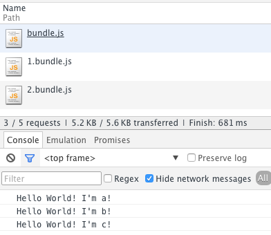

# 分片

> 状态：草稿

随着项目开发过程中越来越大，我们的代码体积也会越来越大，而将所有的脚本都打包到同一个JS文件中显然会带来性能方面的问题（无法并发，首次加载时间过长等）。

webpack也提供了代码分片机制，使我们能够将代码拆分后进行异步加载。

> 值得注意的是，webpack对代码拆分的定位仅仅是为了解决文件过大，无法并发加载，加载时间过长等问题，并不包括公共代码提取和复用的功能。对公共代码的提取将由CommonChunks插件来完成。

要使用webpack的分片功能，首先需要定义“分割点”，即代码从哪里分割成两个文件。

## 分割点

分割点表示代码在此处被分割成两个独立的文件。具体的方式有两种。

使用`require.ensure`：

```javascript
require.ensure(["module-a", "module-b"], function(require) {
	var a = require("module-a");
	// ...
});
```

使用AMD的动态`require`：

```javascript
require(["module-a", "module-b"], function(a, b) {
	// ...
});
```

上面的例子中，`module-a`和`module-b`就会被分割到独立的文件中去，而不会和入口文件打包在同一个文件中。

> TODO：module-a和module-b何时会在同一个文件，何时不会在同一个文件？



example1中使用了`require.ensure`和AMD动态`require`两种方式，来建立分割点，代码在此处被分片。


```javascript
var a=require('./a');
a.sayHello();

require.ensure(['./b'], function(require){
    var b = require('./b');
    b.sayHello(); 
});

require(['./c'], function(c){
    c.sayHello();
});

```

打包后的代码：

- bundle.js -> main.js + a.js
- 1.bundle.js -> b.js
- 2.bundle.js -> c.js

## 多入口

多入口的情况下：

- 入口1 bundle.main1.js -> main.js + a.js
- 入口2 bundle.main2.js -> main2.js + a.js
- 1.bundle.1.js -> b.js
- 2.bundle.2.js -> c.js

可见公共代码a.js并没有被提取出来。

> 因此分片只是分片，并没有自动提取公共模块的作用。