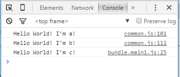

# CommonChunks插件

## 问题

顾名思义，Common Chunks 插件的作用就是提取代码中的公共模块，然后将公共模块打包到一个独立的文件中去，以便在其它的入口和模块中使用。

`main.js`：

```javascript
var a=require('./a');
a.sayHello();


var b = require('./b');
b.sayHello(); 

var c = require('./c');
c.sayHello();
```

`main.2.js`：

```javascript
var a=require('./a');
a.sayHello();


var b = require('./b');
b.sayHello(); 
```

`a`、`b`、`c`和之前一样，只有一个`sayHello()`方法。

打包后看到`bundle.main1.js`和`bundle.main2.js`中分别包含了`a`、`b`、`c`三个模块。其中的`a`和`b`正是我们要使用CommonChunksLoader提取出来的公共模块。

## 小试牛刀

接下来，我们在配置项中添加CommonChunksLoader的配置，使用它来提取公共模块。

```javascript
var webpack = require('webpack');

module.exports = {
    entry:{
        main1:'./main',
        main2:'./main.2'
    },
    output:{
        filename:'bundle.[name].js'
    },
    plugins: [
        new  webpack.optimize.CommonsChunkPlugin('common.js', ['main1', 'main2'])
    ]
};
```

注意第1行，添加了webpack的引用（同时也要在项目目录下安装webpack），然后添加了`plugins`选项，引用了`webpack.optimize.CommonsChunkPlugin`来提取公共模块，参数`common.js`表示公共模块的文件名，后面的数组元素与`entry`一一对应，表示要提取这些模块中的公共模块。

重新使用`webpack`打包后，看到生成的文件中多了一个`common.js`：

```sh
webpack                                                                                                                                                                                                                              
Hash: 2eaa6808a94e7ed42693
Version: webpack 1.12.8
Time: 99ms                                                                                                                                            Asset       Size  Chunks             Chunk Names
bundle.main1.js  417 bytes       0  [emitted]  main1
bundle.main2.js  193 bytes       1  [emitted]  main2
      common.js     3.9 kB       2  [emitted]  common.js
   [0] ./main.js 117 bytes {0} [built]
   [0] ./main.2.js 77 bytes {1} [built]
   [1] ./a.js 97 bytes {2} [built]
   [2] ./b.js 97 bytes {2} [built]
   [3] ./c.js 97 bytes {0} [built]
```

这个`common.js`正是公共部分`a`和`b`两个模块。而生成的`bundle.main1.js`中只包含了`c`模块，`bundle.main2.js`中则没有包含任何其它模块。生成后的代码可参见<https://github.com/TooBug/webpack-guide/blob/master/examples/chapter3/common-chunks-plugin>。

当然，还有一步不能少，就是在HTML中加入公共部分`common.js`：

```html
<script src="./common.js"></script>
<script src="./bundle.main1.js"></script>
```

运行时截图如下：



## 另一个问题

上面的代码成功地将公共模块`a`和`b`提取出来了。但不知道看到此处，你的心里是否会有点疑问。

如果你还没有的话，我们一起来看一下下面这些东东：

1. 什么是入口文件？如果你还记得前面我们给出的定义的话，就会发现，这个地方有两个入口文件！
2. 模块化方案应该允许多个入口文件吗？应该吗？不应该吗？应该吗？不应该吗？
3. 如果模块规划调整了，`common.js`消失了，或者增加了一个`common.2.js`，我应该修改每一个HTML引入的部分吗？

其实写到这里，我是有点迷茫的，按照我对模块化方案的认知，我的观点是：

1. 入口文件应该只有一个，其它的逻辑全部由入口文件处理，因此不应该允许多入口文件
2. 模块规划应该在模块化方案内部完成，不应该还需要时时调整模块调用入口

