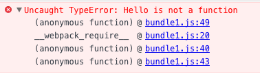
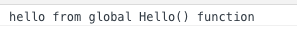

# exports-loader

exports，导出的意思，顾名思义，这个loader是用来将（模块中的）某些内容导出的。之所以为“模块中的”加上括号，是因为实际上只要在模块中能被访问到的成员（变量）都可以被导出，当然也包括全局变量。

> export导出在这里有特定含义，指将模块中的内容暴露出来，供使用方使用。例如CommonJS中的`exports.xxx=xxx`或者`module.exports=xxx`，以及AMD中的`return xxx`都叫导出，导出后外部模块引用时就可以使用被导出的部分。没导出的部分将作为模块私有部分，外部无法访问。

## 导出全局变量

在实际使用中，用`exports-loader`最多的场景是将某些不支持模块化规范的模块所声明的全局变量作为模块内容导出。以Angular.js为例（1.3.14以下版本），它不支持模块化引用，因此如果直接使用以下代码引用`angular`是无效的：

```javascript
var angular = require('angular');
```

此时，`angular`仍然是一个挂载在`window`上的全局变量，而`require`返回的却是`undefined`，导致上述`angular`变量为空。此时就需要我们使用`exports-loader`将全局的`window.angular`作为`angular`模块的返回值暴露出来。

看一个例子，在这个例子中，我们没有真的引用`angular.js`，而是在`example1.2.js`中声明了一个全局变量`HELLO`：

```javascript
window.Hello = function(){
	console.log('hello from global Hello() function');
};
```

接下来，在`example1.1.js`中引用这个模块：

```javascript
var Hello = require('./example1.2');

Hello();
```

然后直接使用webpack打包，生成`bundle1.js`，运行截图如下：



可以看到，由于`example1.2`并没有导出模块，导致`example1.1`在引用的时候报错，找不到`Hello`这个函数。

此时就轮到`exports-loader`上场了。我们建立一个`webpack.config.js`：

```javascript
module.exports = {
	module:{
		loaders:[
			{ test: require.resolve('./example1.2'), loader: "exports?Hello" }
		]
	}
};
```

其中的`test`表示使用`loader`的条件，这里使用了`require.resolve`解析出来的路径，表示只处理`example1.2.js`，loader中指定了`exports-loader`，参数为`Hello`，意为将`Hello`作为模块导出值。

重新打包生成`bundle2.js`，运行截图如下：



可见`Hello`函数已被正确调用。

查看`bundle2.js`中的代码可以清楚地看到`HELLO`被导出的过程：

```javascript
/***/ function(module, exports) {

	window.Hello = function(){
		console.log('hello from global Hello() function');
	};


	/*** EXPORTS FROM exports-loader ***/
	module.exports = Hello;

/***/ }
```

> 注：这里其实有两个示例，分别生成了`bundle1.js`和`bundle2.js`，由于`bundle1.js`需要在`webpack.config.js`生效前创建，因此如果你克隆代码后自己运行的话，在生成`bundle1.js`前请将`webpack.config.js`改名，否则其中的配置会生效，最终效果和第二例一样。

## 导出局部变量

如前文所述，`exports-loader`可以导出一切在模块内可以访问的变量，因此如果模块内定义了一个局部变量，也是可以导出的，方法和上面的例子几乎完全一样，这里就不再演示。

## 更多用法

上面例子中的配置文件是通过`webpack.config.js`来指定的，你也可以选择用其它方法来指定，详情见[使用loader](./using-loaders.html)。

此外，上面例子中我们只导出了一个变量，此时该变量就是模块被引用时的值（通过`module.exports`导出）。事实上，`exports-loader`还可以支持同时导出多个变量，例如`exports?HELLO,WORLD`会生成如下代码：

```javascript
exports.HELLO = HELLO;
exports.WORLD = WORLD;
```

此时模块的导出值是一个对象，其中的各个键值对是我们指定的变量，引用时需要使用类似`require('example1.2').HELLO`的形式。

`exports-loader`还支持变量名和导出名不同，例如`exports?HELLO=obj.hello,WORLD=shijie`会生成如下代码：

```javascript
exports.HELLO = obj.hello;
exports.WORLD = shijie;
```

一目了然，不再解释。

本文全部示例代码见<https://github.com/TooBug/webpack-guide/tree/master/examples/chapter4/exports-loader/example1>。
